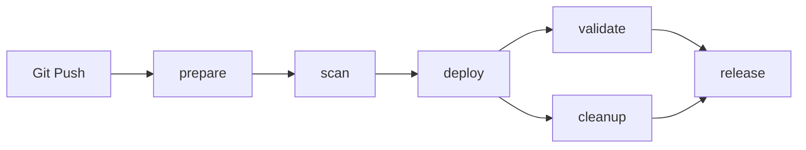
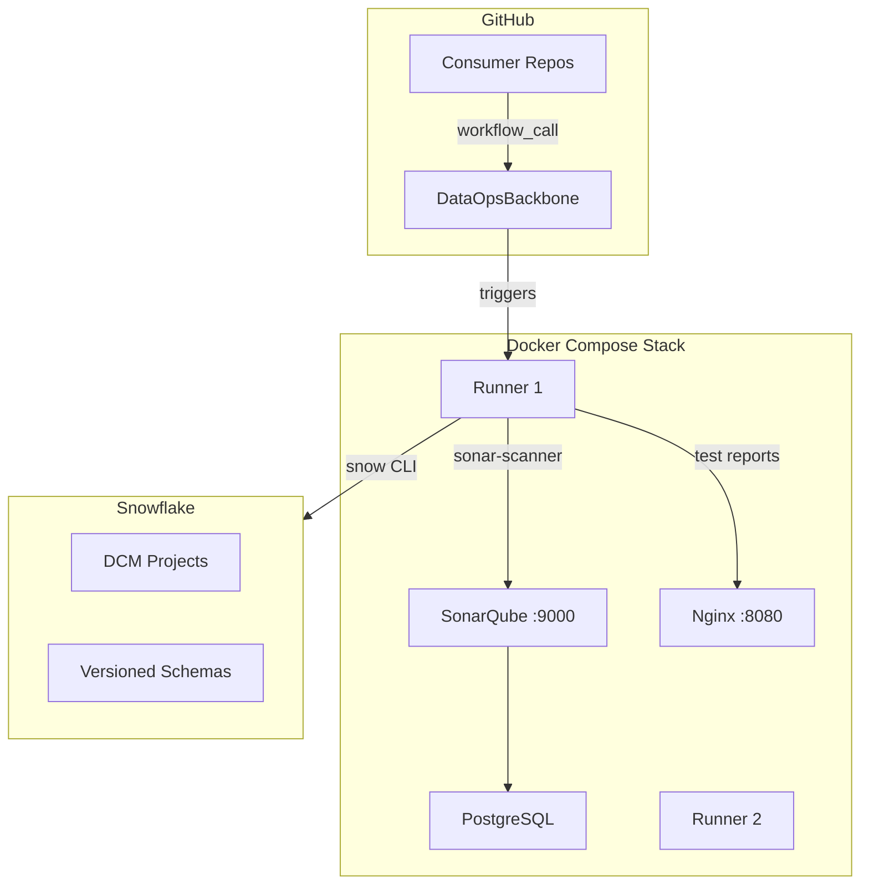
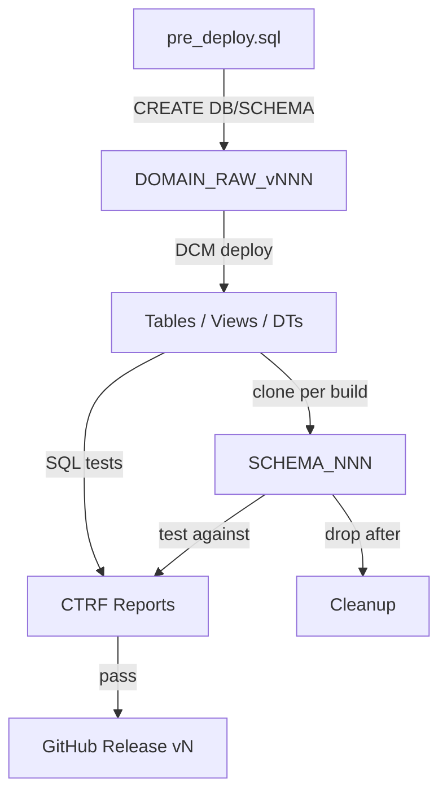
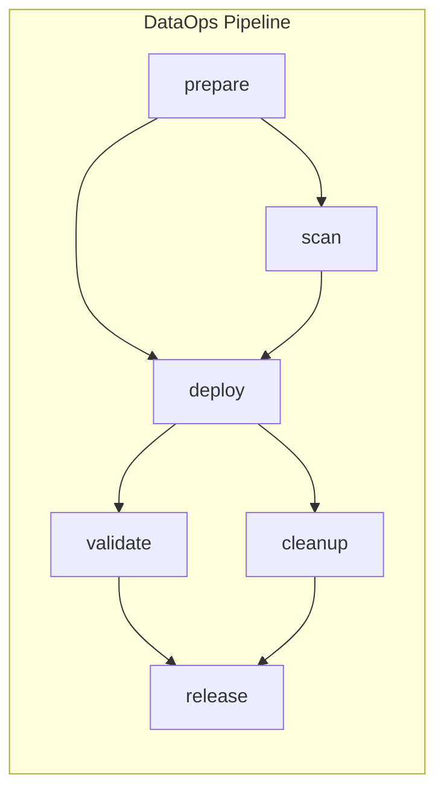

# **DataOps Unchained: Infrastructure that Scales**

[](https://github.com/zbrainiac-labs/DataOpsBackbone/actions/workflows/docker-publish.yml)

> **A hands-on reference architecture for fully automated SQL code quality pipelines using SonarQube, GitHub Actions, and Snowflake.**

---

## Why / What / How

### Why?
#### In large, federated organizations, scaling analytics isn't (just) a tech challenge — it's an operational one.

From a technological and operational perspective, automation, governance and consistency are vital for scaling analytics in large, federated organisations. With agile methodology and modularisation, deployment volume can rise to hundreds or thousands per day, so manual QA simply cannot keep pace. For example, if 15 analytics teams were to deploy changes daily, the number of full-time reviewers required for manual reviews would be prohibitively high, resulting in bottlenecks, missed checks and an increased risk of inconsistent standards and data incidents.
DataOpsBackbone addresses these issues by automating every critical step:

**Quality Gates** leverage **SonarQube** code scans to enforce SQL and customisable coding rules based on regular expressions, which are applied automatically with every git push request. For example, forgetting to prefix a schema name or hardcoding a database name triggers an automated block and feedback, thereby enforcing standards before code can be shipped.
- Releases are versioned and deployed via DCM (Database Change Management) with plan/deploy semantics, then validated through SQL tests. This keeps production safe from changes that have not been properly tested.
- Governance is built in: rules such as 'no grants to PUBLIC' or 'only UTC TIMESTAMP allowed' are continuously enforced, and all compliance-relevant data (such as SQL code scans and test results) is logged for auditing purposes.
- Teams have full transparency and can be agile and reduce technical debt themselves. Automation enforces rules and monitors testing over time, so centralised approvals no longer become a bottleneck.

This setup offers repeatability, auditability and peace of mind, enabling new teams to get up and running quickly and allowing developers to focus on creating value rather than policing standards. The showcased projects are practical blueprints for achieving reliable, scalable analytics operations with Snowflake and GitHub Actions, not just demos.

---

### What?

A DataOps pipeline that automates:

- SQL linting & validation (SonarQube + regex rules + SQLFluff)
- Declarative schema deployment via Snowflake DCM (Database Change Management)
- SQL validation testing against deployed objects (CTRF JSON reports)
- Test trend reporting via UnitTestHistory v3.0
- Packaging deployable artifacts

#### Overview of the infrastructure:
#### CI/CD Pipeline Flow (6 composable jobs):



#### Runtime Component Topology:



#### Snowflake Object Lifecycle:




---

### How?

It combines:

- **GitHub Actions** — reusable workflow called by all consumer repos
- **Self-hosted runners** (2 org-level runners on `zbrainiac-labs`)
- **SonarQube** extended with SQL & Text plugins
- **Docker Compose** for local stack orchestration
- **Snowflake CLI** with DCM for declarative deployment (`DEFINE` syntax + Jinja templating)
- **SQL Validation** with CTRF JSON test reports
- **UnitTestHistory** for HTML trend dashboards

---

## Reusable Workflow Architecture

DataOpsBackbone provides a **single reusable GitHub Actions workflow** that all consumer repos call:

```yaml
# In each consumer repo (.github/workflows/pipeline.yml):
permissions:
  id-token: write
  contents: read

jobs:
  pipeline:
    uses: zbrainiac-labs/DataOpsBackbone/.github/workflows/dataops-pipeline.yml@main
    with:
      SOURCE_DATABASE: <DB_NAME>
      SOURCE_SCHEMA: <SCHEMA_NAME>
      DCM_PROJECT_IDENTIFIER: <DB.SCHEMA.PROJECT>
      DCM_TARGET: DEV
    secrets: inherit
```

### Pipeline Jobs (6 composable jobs):



| Job | Timeout | Purpose |
|-----|---------|---------|
| **prepare** | 10 min | Validate inputs, OIDC auth, pre-deploy SQL |
| **scan** | 30 min | Extract deps, SQLFluff, SonarQube, Quality Gate |
| **deploy** | 20 min | Clone (optional), DCM deploy, post-deploy, custom scripts |
| **validate** | 15 min | SQL validation tests, CTRF-to-SonarQube conversion |
| **cleanup** | 10 min | Drop clone schema (always runs if clone enabled) |
| **release** | 15 min | Deploy to original, zip, GitHub release, summary |

### Authentication

The pipeline uses **OIDC Workload Identity Federation** by default (secretless). GitHub issues a short-lived token per job that Snowflake validates directly. No PAT or stored secrets needed.

Fallback to `SNOW_CONFIG_B64` (PAT-based) is available via `USE_OIDC: false`.

> **Note:** `SNOWFLAKE_ACCOUNT` is required when using OIDC auth (`USE_OIDC: true`).
> When using PAT fallback (`USE_OIDC: false`), the account is taken from the Snowflake CLI's configured connection in `SNOW_CONFIG_B64`.

#### OIDC Setup (one-time, org-level)

**1. Configure GitHub org OIDC subject claim:**

Go to: https://github.com/organizations/YOUR_ORG/settings/actions/oidc-configuration

Set "Subject claim template" to: `repository_owner`

Then apply via API (requires `admin:org` scope):
```bash
gh auth refresh -h github.com -s admin:org
gh api -X PUT orgs/YOUR_ORG/actions/oidc/customization/sub \
  --input - <<< '{"include_claim_keys":["repository_owner"]}'
```

This makes all repos in the org emit the same OIDC subject: `repository_owner:YOUR_ORG`

**2. Configure Snowflake service user:**

```sql
USE ROLE ACCOUNTADMIN;
ALTER USER SVC_CICD SET
  WORKLOAD_IDENTITY = (
    TYPE = OIDC
    ISSUER = 'https://token.actions.githubusercontent.com'
    SUBJECT = 'repository_owner:YOUR_ORG'
  );
```

**3. Add `id-token: write` to consumer repo callers:**

```yaml
permissions:
  id-token: write
  contents: write
  actions: read
  checks: write
```

**4. No secrets needed** — remove `SNOW_CONFIG_B64` org secret after verification.

#### Local Development (PAT-based fallback)

For local Docker development, `start.sh` still generates `SNOW_CONFIG_B64` from `.env` variables. This is used by the runner containers for SonarQube rule setup and local testing only.

### Pipeline Hardening (built-in):
- **OIDC auth** — secretless, short-lived tokens per job (no stored PAT)
- **Multi-job architecture** — parallelization, resumability, clear failure boundaries
- **Environment protection** — `environment:` on deploy/release for approval gates
- **Concurrency control** — prevents parallel deploys to the same schema
- **Input validation** — regex-validated database/schema/project identifiers
- **Shell strict mode** — `set -Eeuo pipefail` catches silent failures
- **Retry logic** — 3 attempts with exponential backoff on Snowflake operations
- **Timeouts** — per-job timeouts prevent runaway execution
- **Pinned actions** — all GitHub Actions pinned to commit SHAs
- **Identifier quoting** — Snowflake `IDENTIFIER()` for defense-in-depth
- **DRY_RUN mode** — scan without deploying (for PR validation)

### Enabling Quality Gate Enforcement

To block deployments on SonarQube quality gate failure, set `QUALITY_GATE_ENFORCED: true` in your consumer repo's workflow caller:

```yaml
jobs:
  pipeline:
    uses: zbrainiac-labs/DataOpsBackbone/.github/workflows/dataops-pipeline.yml@main
    with:
      SOURCE_DATABASE: MY_DB
      SOURCE_SCHEMA: MY_SCHEMA
      DCM_PROJECT_IDENTIFIER: MY_DB.MY_SCHEMA.MY_PROJECT
      QUALITY_GATE_ENFORCED: true
    secrets: inherit
```

When disabled (default), quality gate failures are reported but do not block the pipeline.

### Consumer Repos:
| Repo | Database | DCM Schema | Data Schemas | Clone per Build |
|------|----------|------------|--------------|:---:|
| [mother-of-all-Projects](https://github.com/zbrainiac-labs/mother-of-all-Projects) | OPS_DEV | OPS_DCM | OPS_RAW_v001 | ✅ |
| [project-one](https://github.com/zbrainiac-labs/project-one) | ONE_DEV | ONE_DCM | ONE_RAW_v001 | ✅ |
| [MasterDataManagement](https://github.com/zbrainiac-labs/MasterDataManagement) | MDM_DEV | MDM_DCM | MDM_RAW_v001, MDM_AGG_v001, MDM_SRV_v001 | |
| [crm_dcm_project](https://github.com/zbrainiac-labs/crm_dcm_project) | CRM_DEV | CRM_DCM | CRM_RAW_v001, CRM_CUR_v001 | |
| [SyntheticRetailBank](https://github.com/zbrainiac-labs/SyntheticRetailBank) | AAA_DEV_SYNTHETIC_BANK | AAA_DCM | CRM_RAW_v001, PAY_RAW_v001, ... | ✅ |
| [sharing_any_objects](https://github.com/zbrainiac-labs/sharing_any_objects) | ECO_DEV | ECO_DCM | ECO_RAW_v001 | ✅ |
| [crew-asset-management](https://github.com/zbrainiac-labs/crew-asset-management) | SAM_DEMO | SAM_DCM | SAM_RAW_v001 | |

---

## Project Structure

```
DataOpsBackbone/
├── .github/workflows/
│   ├── dataops-pipeline.yml    # Reusable 6-job pipeline (called by all repos)
│   └── docker-publish.yml      # Docker image CI
├── github-runner/
│   ├── Dockerfile              # Self-hosted runner image (incl. SQLFluff, yq)
│   ├── entrypoint.sh           # Runner registration (org/repo scope)
│   ├── github-runner_v1.sh     # Decode SNOW_CONFIG_B64 (PAT fallback)
│   ├── sonar-rules-setup.sh    # Auto-create SonarQube quality profile (40 rules)
│   ├── sonar-token-init.sh     # Auto-generate SONAR_TOKEN per runner
│   ├── sonar-scanner_v2.sh     # Run sonar-scanner + import SQLFluff + test results
│   ├── sqlfluff-to-sonar.sh    # Run SQLFluff → SonarQube Generic Issue format
│   ├── sqlfluff_to_sonar.py    # JSON converter (SQLFluff → SonarQube)
│   ├── ctrf_to_sonar_converter.py  # CTRF JSON → SonarQube Test Execution XML
│   ├── sqlfluff_sonar.cfg      # SQLFluff config (non-overlapping rules only)
│   ├── ddl_uppercase_keywords.py # Normalize GET_DDL() output
│   ├── sql_validation_v4.sh    # SQL tests → CTRF JSON
│   ├── snowflake-deploy-dcm_v1.sh
│   ├── snowflake-extract-dependencies_v1.sh
│   ├── render-sql_v1.sh        # Jinja-style template rendering
│   ├── unitth.jar              # UnitTestHistory v3.0
│   └── tests.sqltest           # Sample test file
├── sqlfluff/                   # Standalone SQLFluff linter (alternative to SonarQube)
│   ├── .sqlfluff               # SQLFluff config (all rules)
│   ├── lint.py                 # Combined runner: SQLFluff + custom regex rules
│   ├── plugins/dataops_rules/  # 28 custom regex rules (DO01–DO28)
│   └── test_sql/               # Good/bad SQL examples for testing
├── docs/
│   ├── QUICKSTART.md           # 15-minute first pipeline guide
│   └── TROUBLESHOOTING.md      # Per-job failure/recovery guide
├── sonarqube/Dockerfile        # Custom SonarQube image
├── nginx/default.conf          # Nginx for test report serving
├── backup/                     # SonarQube quality profile backups
├── images/                     # Documentation images
├── docker-compose.yml          # Full stack (SonarQube + 2 runners + nginx)
└── start.sh                    # One-command startup
```

---
## Architecture Overview - Data objects

The showcase is built around two distinct data domains, each represented as an individual database within the same Snowflake account. This approach allows for logical isolation and independent management of domain-specific data assets.

Within each domain (database), schemas are strategically utilized to achieve two key objectives:
* **Maturity Levels:** Schemas separate data objects based on their maturity level (e.g., raw, curated, conformed). This provides a clear path for data as it progresses through various transformation stages.
* **Versioning:** Schemas also incorporate versioning for underlying database objects like tables, views, stages and procedures. This ensures traceability, facilitates rollbacks, and supports agile development by allowing iterative changes without disrupting existing consumers.

### Why This Approach?
1. **Improved Organization:** Data assets are logically grouped by business domain, making them easier to discover and manage.
2. **Enhanced Data Governance:** Clear maturity levels and versioning promote better control over data quality and evolution.
3. **Scalability & Maintainability:** The modular design reduces interdependencies, simplifying development, testing, and maintenance.
4. **Demonstrates Best Practices:** Provides a practical example of implementing a domain-driven data architecture in Snowflake.


### Drive modularization for better Resilience

We not only use static source code analysis to review new code coming into the environment, but also check the existing setup and enforce isolation more effectively.
By isolating domains and versions, the impact of changes or failures in one area on others is minimised, thereby enhancing overall system stability and aiding regression testing.


---

## Naming Convention

All Snowflake object names use **UPPERCASE** with underscore separators.

### Database: `{DOMAIN}_{ENV}`

| Position | Field | Values |
|----------|-------|--------|
| 1-3 | Domain | 3-char business domain (`IOT`, `CLR`, `PAY`, `CRM`, `REF`) |
| 4-7 | Environment | `_DEV`, `_TE1`, `_PER`, `_PRD` |

Examples: `CLR_DEV`, `PAY_PRD`, `IOT_TE1`

### Schema: `{DOMAIN}_{MATURITY}_v{NNN}` or `{DOMAIN}_DCM`

| Position | Field | Values |
|----------|-------|--------|
| 1-3 | Domain | Same 3-char domain code |
| 4-8 | Maturity | `_RAW_`, `_CUR_`, `_AGG_`, `_GOL_` |
| 9-12 | Version | `v001` -- `v999` |

DCM schemas use `{DOMAIN}_DCM` (unversioned) — one per database, holds the DCM project definition.

Examples: `CRM_RAW_v001`, `IOT_AGG_v012`, `REF_CUR_v003`, `OPS_DCM`, `CRM_DCM`

### Database Objects (tables, views, stages, tasks, etc.): `{DOMAIN}{COMP}_{MATURITY}_{TYPE}_{TEXT}`

| Position | Field | Description | Values |
|----------|-------|-------------|--------|
| 1-3 | Domain | 3-char business domain | `IOT`, `CLR`, `PAY`, `CRM`, `REF` |
| 4 | Component | Sub-component (GitHub repo) | Single char: `I`, `A`, `T`, `P`, etc. |
| 5-8 | Maturity | Data maturity level | `_RAW`, `_CUR`, `_AGG`, `_GOL` |
| 9-12 | Object type | Snowflake object type | `_TB_`, `_VW_`, `_DT_`, `_ST_`, `_FF_`, `_SP_`, `_TK_` |
| 13+ | Free text | Business-meaningful name | Uppercase, underscores allowed |

Examples:
- `ICGI_RAW_TB_SWIFT_MESSAGES` -- ICG domain, Ingestion repo, raw table
- `ICGA_AGG_DT_SWIFT_PACS008` -- ICG domain, Aggregation repo, aggregated dynamic table
- `IOTI_RAW_VW_SENSOR_GEOLOC` -- IOT domain, Ingestion repo, raw view
- `ICGI_RAW_ST_SWIFT_INBOUND` -- ICG domain, Ingestion repo, raw stage
- `ICGI_RAW_FF_XML` -- ICG domain, Ingestion repo, raw file format

---
## SQL Linting Rules and Regex Patterns
This list provides a few examples of SQL validation rules, each of which is paired with a regular expression (regex) that can be used to identify non-compliant code using the Community Text plugin of SonarQube.

Backups of these rules, which can be restored as a Quality Profile, are available in the repository ([link](backup/2026-04-27_quality_profiles_text_plugin.xml)). Rules are also auto-created at runner startup via `sonar-rules-setup.sh`.

### Safety Rules

#### 1. Disallow `CREATE SCHEMA` without `IF NOT EXISTS` or `REPLACE`
```regex
(?i)^\s*CREATE\s+(?!OR\s+REPLACE\b)(?!.*\bIF\s+NOT\s+EXISTS\b).*?\bSCHEMA\b
```

#### 2. Disallow CREATE TABLE without IF NOT EXISTS or REPLACE
```regex
(?is)^(?!\s*--).*CREATE\s+(?!OR\s+REPLACE\b|.*IF\s+NOT\s+EXISTS\b).*TABLE\b
```

#### 3. Disallow CREATE statements with hardcoded database and/or schema prefix
```regex
(?i)^(?!\s*--)\s*create\s+(or\s+replace\s+)?(table|view|schema)\s+(if\s+not\s+exists\s+)?[a-z0-9_]+\.[a-z0-9_]+(\.[a-z0-9_]+)?
```

#### 4. Disallow GRANT statements to PUBLIC
```regex
(?i)^(?!\s*--).*grant\s+.*\s+to\s+public\b
```

#### 5. Disallow dropping objects without IF EXISTS
```regex
(?i)^\s*DROP\s+(SCHEMA|TABLE|VIEW|DYNAMIC\s+TABLE|STAGE|FILE\s+FORMAT|PROCEDURE|FUNCTION|TASK)\s+(?!IF\s+EXISTS\b)
```

#### 6. Disallow hardcoded USE DATABASE, USE SCHEMA, or USE ROLE statements
```regex
(?i)^(?!\s*--)\s*USE\s+(DATABASE|SCHEMA|ROLE)\b
```

### Data Type Rules

#### 7. Disallow TIMESTAMP_NTZ and TIMESTAMP_LTZ (only TIMESTAMP_TZ allowed)
```regex
^(?!\s*--).*\bTIMESTAMP_(NTZ|LTZ)(\s*\(\s*\d+\s*\))?\b
```

### Naming Convention Rules

#### 8. Schema names must follow `{DOMAIN}_{MATURITY}_` prefix pattern
```regex
(?i)^(?!\s*--)\s*CREATE\s+(OR\s+REPLACE\s+)?SCHEMA\s+(IF\s+NOT\s+EXISTS\s+)?(?:[a-z0-9_]+\.)?(?!RAW_|CUR_|AGG_|GOL_|REF_)[a-z0-9_]+;
```

#### 9. Schema names must end with version pattern `_vNNN`
```regex
(?i)^(?!\s*--)\s*CREATE\s+(OR\s+REPLACE\s+)?SCHEMA\s+(IF\s+NOT\s+EXISTS\s+)?(?:[a-z0-9_]+\.)?[a-z0-9_]+(?<!_v\d{3});
```

#### 10. Table names must follow `{DOM}{COMP}_{MAT}_{TB}_` pattern
```regex
(?i)^(?!\s*--)\s*CREATE\s+(OR\s+REPLACE\s+)?(?!DYNAMIC\s)TABLE\s+(IF\s+NOT\s+EXISTS\s+)?(?:[A-Z0-9_]+\.){0,2}(?![A-Z0-9]{3}[A-Z]_(RAW|CUR|AGG|GOL)_TB_)[A-Z_][A-Z0-9_]*
```

#### 11. View names must follow `{DOM}{COMP}_{MAT}_{VW}_` pattern
```regex
(?i)^(?!\s*--)\s*CREATE\s+(OR\s+REPLACE\s+)?VIEW\s+(?:[A-Z0-9_]+\.){0,2}(?![A-Z0-9]{3}[A-Z]_(RAW|CUR|AGG|GOL)_VW_)[A-Z_][A-Z0-9_]*
```

#### 12. Dynamic Table names must follow `{DOM}{COMP}_{MAT}_{DT}_` pattern
```regex
(?i)^(?!\s*--)\s*CREATE\s+(OR\s+REPLACE\s+)?DYNAMIC\s+TABLE\s+(?:[A-Z0-9_]+\.){0,2}(?![A-Z0-9]{3}[A-Z]_(RAW|CUR|AGG|GOL)_DT_)[A-Z_][A-Z0-9_]*
```

#### 13. Stage names must follow `{DOM}{COMP}_{MAT}_{ST}_` pattern
```regex
(?i)^(?!\s*--)\s*CREATE\s+(OR\s+REPLACE\s+)?STAGE\s+(?:[A-Z0-9_]+\.){0,2}(?![A-Z0-9]{3}[A-Z]_(RAW|CUR|AGG|GOL)_ST_)[A-Z_][A-Z0-9_]*
```

### Dependency Rules

#### 14. Disallow Cross-Database Dependencies
```regex
^.*cross_db_true.*$
```

#### 15. Disallow Cross-Schema Dependencies
```regex
^.*cross_schema_true.*$
```

### Security & Access Control Rules

#### 16. Disallow GRANT ALL PRIVILEGES
```regex
(?i)^(?!\s*--)\s*GRANT\s+ALL\s+(PRIVILEGES\s+)?ON\b
```

#### 17. Disallow ACCOUNTADMIN usage in SQL scripts
```regex
(?i)^(?!\s*--)\s*(USE\s+ROLE|SET\s+ROLE|GRANT\s+.*TO\s+ROLE|GRANT\s+ROLE)\s+.*\bACCOUNTADMIN\b
```

#### 18. Disallow plaintext passwords in DDL
```regex
(?i)^(?!\s*--)\s*.*PASSWORD\s*=\s*'[^']+'
```

### Data Quality & Consistency Rules

#### 19. ~~Disallow SELECT * (force explicit column lists)~~ — DISABLED
```regex
(?i)^(?!\s*--)\s*SELECT\s+\*\s+FROM\b
```
> **Disabled**: Redundant — already covered by SQLFluff AM04 (`SELECT *` unknown columns) and SQLCC C002 (`SELECT *` used).

#### 20. Disallow FLOAT/DOUBLE/REAL -- prefer NUMBER(p,s)
```regex
^(?!\s*--).*\b(FLOAT|DOUBLE|REAL)\b
```

#### 21. Disallow VARCHAR without explicit length
```regex
^(?!\s*--).*\bVARCHAR\s*[^(]
```

#### 22. CREATE TABLE must include COMMENT
```regex
(?i)^(?!\s*--)\s*CREATE\s+(OR\s+REPLACE\s+)?TABLE\s+(?!.*\bCOMMENT\b).*;\s*$
```

### Performance & Best Practice Rules

#### 23. Disallow ORDER BY in view definitions
```regex
(?i)^(?!\s*--)\s*CREATE\s+(OR\s+REPLACE\s+)?VIEW\b[\s\S]*?\bORDER\s+BY\b
```

#### 24. Disallow COPY INTO without ON_ERROR clause
```regex
(?i)^(?!\s*--)\s*COPY\s+INTO\s+(?!.*\bON_ERROR\b).*;\s*$
```

#### 25. Dynamic Tables must specify TARGET_LAG
```regex
(?i)^(?!\s*--)\s*CREATE\s+(OR\s+REPLACE\s+)?DYNAMIC\s+TABLE\s+(?!.*\bTARGET_LAG\b)
```

### Naming Convention Rules (additional object types)

#### 26. File Format names must follow `{DOM}{COMP}_{MAT}_FF_` pattern
```regex
(?i)^(?!\s*--)\s*CREATE\s+(OR\s+REPLACE\s+)?FILE\s+FORMAT\s+(?:[A-Z0-9_]+\.){0,2}(?![A-Z0-9]{3}[A-Z]_(RAW|CUR|AGG|GOL)_FF_)[A-Z_][A-Z0-9_]*
```

#### 27. Stored Procedure names must follow `{DOM}{COMP}_{MAT}_SP_` pattern
```regex
(?i)^(?!\s*--)\s*CREATE\s+(OR\s+REPLACE\s+)?PROCEDURE\s+(?:[A-Z0-9_]+\.){0,2}(?![A-Z0-9]{3}[A-Z]_(RAW|CUR|AGG|GOL)_SP_)[A-Z_][A-Z0-9_]*
```

#### 28. Task names must follow `{DOM}{COMP}_{MAT}_TK_` pattern
```regex
(?i)^(?!\s*--)\s*CREATE\s+(OR\s+REPLACE\s+)?TASK\s+(?:[A-Z0-9_]+\.){0,2}(?![A-Z0-9]{3}[A-Z]_(RAW|CUR|AGG|GOL)_TK_)[A-Z_][A-Z0-9_]*
```

## Monitoring
### Issue overview


### Issue within code


### Technical debt


### Monitor the history of test case execution


## SonarQube + SQLFluff — Integrated Scanning

Both tools run in the CI/CD pipeline. SQLFluff issues are imported into SonarQube as external issues via `sonar.externalIssuesReportPaths`, giving **one dashboard for everything**.

```
Pipeline: ... → SQLFluff lint → sonar-scanner (imports sqlfluff_issues.json) → Quality Gate → ...
```

### Scanner Configuration

The scanner uses `sonar.language=sql` to ensure the SQL Code Checker plugin claims `.sql` files. The text plugin (`txt:`) runs alongside via its own sensor. Only `.git/**` is excluded — all other files are indexed.

### Rule Ownership (no duplicates)

Each rule runs in **exactly one tool** to avoid double-counting:

| Tool | Responsibility | Rules |
|------|---------------|-------|
| **SonarQube txt:** | Safety, security, naming, data types, deps, style | 40 rules |
| **SonarQube SQLCC:** | Structural SQL (views, joins, nulls, ORDER BY) | 19 rules |
| **SQLFluff** (external) | Formatting, AST-based style, implicit aliases | 23 rules |
| **Total** | | **82 rules** |

#### SonarQube Text Plugin (`txt:`) — 40 regex-based rules

| Category | Rules | Examples |
|----------|------:|---------|
| Safety | 6 | CREATE without IF NOT EXISTS, DROP without IF EXISTS, USE statements, ALTER TABLE DROP COLUMN, TRUNCATE |
| Security | 4 | GRANT PUBLIC, ACCOUNTADMIN, GRANT ALL, plaintext passwords |
| Naming conventions | 15 | Table/View/DT/Stage/Schema/FF/SP/Task/Stream/Semantic View naming, maturity-level code enforcement |
| Data types | 3 | TIMESTAMP_NTZ/LTZ, FLOAT/DOUBLE/REAL, VARCHAR without length |
| Quality | 6 | SELECT *, TABLE COMMENT, DEFINE COMMENT, ORDER BY in views, COPY ON_ERROR, DT TARGET_LAG |
| Dependencies | 2 | Cross-database, cross-schema |
| Style | 4 | Keywords UPPER, implicit alias, JOIN without ON, ELSE NULL |

**Regex fix applied**: Rules 7 (TIMESTAMP), 20 (FLOAT), 21 (VARCHAR) use `^(?!\s*--).*` lookahead instead of the broken `(?<!--.*)` lookbehind which silently failed in Java's regex engine.

#### SonarQube SQL Code Checker (`SQLCC:`) — AST-based

| Rule | Description |
|------|-------------|
| C002 | SELECT * used |
| C003 | INSERT without column list |
| C009 | Non-sargable statement |
| C012 | NULL comparison with `=` |
| C017 | ORDER BY without ASC/DESC |
| C022 | Non-materialised view |
| C023 | Cartesian join |

#### SQLFluff (external issues in SonarQube) — 23 AST-based rules, excludes `sources/definitions/`

| Rule | Description | Severity |
|------|-------------|----------|
| LT01 | Unnecessary whitespace | INFO |
| LT02 | Indentation | INFO |
| LT06 | Function name spacing | INFO |
| LT08 | CTE bracket newline | INFO |
| LT09 | Select targets formatting | INFO |
| LT10 | SELECT modifiers placement | INFO |
| LT12 | EOF newline | INFO |
| LT14 | Inconsistent line endings | INFO |
| CP02 | Identifier casing | MINOR |
| CP04 | Boolean casing | MINOR |
| AL01 | Missing AS keyword (implicit alias) | MINOR |
| AL02 | Implicit column alias | MINOR |
| AL08 | Column alias in GROUP BY | MINOR |
| AM03 | Ambiguous ORDER BY | MINOR |
| AM04 | SELECT * unknown columns | MINOR |
| AM05 | JOIN without ON clause | MAJOR |
| AM09 | LIMIT without ORDER BY | MINOR |
| RF02 | Unnecessary qualified references | MINOR |
| RF03 | Single CASE to IF | MINOR |
| RF04 | Keywords as identifiers | MAJOR |
| ST06 | Unnecessary ELSE NULL | MINOR |
| ST07 | USING vs ON in joins | MINOR |
| ST09 | Nested CASE | MINOR |

#### Excluded from SQLFluff (handled by SonarQube or not applicable)
- **PRS** — parse errors on DCM `DEFINE` syntax (SonarQube text plugin handles these files)
- **CP01** — keywords UPPER (handled by `txt:Keywords_must_be_UPPER`)

### DDL Post-Processing

The `dependencies/ddl.sql` file is auto-generated by Snowflake's `GET_DDL()` which outputs lowercase keywords and tab indentation. The `ddl_uppercase_keywords.py` filter normalizes the output:
- Uppercases all unquoted identifiers and SQL keywords
- Converts tabs to 4-space indentation
- Adds space before `(` in object definitions
- Expands inline `SELECT ... FROM` onto multiple lines
- Preserves string literals and comments

## Quick Setup Guide


### Step 1: Create CICD role and service user

Each consumer repo has its own `pre_deploy.sql` that creates the database, schema, and DCM project. The CICD role and service user must be created once manually:

```SQL
USE ROLE ACCOUNTADMIN;
CREATE ROLE IF NOT EXISTS CICD;
GRANT CREATE DATABASE ON ACCOUNT TO ROLE CICD;
GRANT CREATE ROLE ON ACCOUNT TO ROLE CICD;
GRANT CREATE WAREHOUSE ON ACCOUNT TO ROLE CICD;
GRANT MANAGE WAREHOUSES ON ACCOUNT TO ROLE CICD;
GRANT EXECUTE TASK ON ACCOUNT TO ROLE CICD;
GRANT EXECUTE MANAGED TASK ON ACCOUNT TO ROLE CICD;
GRANT IMPORTED PRIVILEGES ON DATABASE SNOWFLAKE TO ROLE CICD;
GRANT ROLE CICD TO USER SVC_CICD;
```


### Step 2: Generate a PAT for the service user

```SQL
ALTER USER IF EXISTS SVC_CICD ADD PROGRAMMATIC ACCESS TOKEN CICD_PAT
  ROLE_RESTRICTION = CICD
  DAYS_TO_EXPIRY = 365
  COMMENT = 'CI/CD pipeline PAT';
-- copy <your token>
```

### Step 3: Configure `.env` (single source of truth)

All configuration lives in one file. `start.sh` auto-generates `SNOW_CONFIG_B64` and the runner auto-generates `SONAR_TOKEN` at startup.

```dotenv
# GitHub
GH_RUNNER_TOKEN=<...>
GITHUB_OWNER=<your GitHub org/user>
GITHUB_ORG=<your GitHub org for org-level runners>
GH_ORG_TOKEN=<classic PAT with admin:org scope>

# SonarQube (SONAR_TOKEN is auto-generated at runner startup)
POSTGRES_USER=sonar
POSTGRES_PASSWORD=sonar
POSTGRES_DB=sonarqube
SONAR_JDBC_USERNAME=sonar
SONAR_JDBC_PASSWORD=sonar
SONAR_ADMIN_PASS=<CHANGE_ME_STRONG_PASSWORD>

# Snowflake (SNOW_CONFIG_B64 is auto-generated by start.sh)
CONNECTION_NAME=<your-connection-name>
SNOW_ACCOUNT=<your-account>
SNOW_USER=SVC_CICD
SNOW_ROLE=CICD
SNOW_DATABASE=DATAOPS
SNOW_SCHEMA=IOT_RAW_V001
SNOW_WAREHOUSE=MD_TEST_WH
SNOW_PAT=<your PAT from Step 2>
```

---
### Step 4: Configure Authentication

**Option A: OIDC (recommended, secretless)** — see "OIDC Setup" section above. No GitHub secrets needed.

**Option B: PAT fallback** — set `USE_OIDC: false` in consumer repos and upload the secret:

```bash
./start.sh  # generates SNOW_CONFIG_B64 automatically
gh secret set SNOW_CONFIG_B64 --org zbrainiac-labs --visibility all
```

`SONAR_TOKEN` and `SNOW_CONNECTION_NAME` secrets are **no longer needed** -- they are auto-generated at runtime.

---

### Step 5: Run It

1. Start your local stack via `./start.sh`
2. Access SonarQube at: [http://localhost:9000](http://localhost:9000)  
  **Login**: `admin` / `<your SONAR_ADMIN_PASS from .env>`

  > **Warning**: Never use example passwords in production. Set unique, strong values in your `.env` file.
3. Push to any consumer repo — the reusable workflow triggers automatically
4. Check results in SonarQube
5. Monitor SQL test results (incl. history) at: [http://localhost:8080](http://localhost:8080)

---

## Docker Compose Services

| Service | Purpose | Port |
|---------|---------|------|
| `sonarqube` | Code quality + custom SQL rules | 9000 |
| `db` | PostgreSQL backend for SonarQube | - |
| `runner1` | Org-level self-hosted GitHub runner | - |
| `runner2` | Org-level self-hosted GitHub runner | - |
| `nginx-server` | Serves UnitTestHistory HTML reports | 8080 |

---

## Compatibility Matrix

| Component | Minimum | Tested | Notes |
|-----------|---------|--------|-------|
| Snowflake CLI | 3.16.0 | 3.18.0 | OIDC requires >= 3.11 |
| SonarQube | 10.0+ | 26.x (Community Build) | Scanner 8.x requires 10+ |
| Sonar Scanner CLI | 8.0.0 | 8.1.0.6389 | Use 5.x for SonarQube 9.x |
| SQLFluff | 3.0+ | latest | Snowflake dialect |
| GitHub Actions Runner | 2.320+ | 2.330.0 | Self-hosted, Linux x64/arm64 |
| Docker Compose | v2+ | v2.x | No `version:` key needed |
| PostgreSQL | 15+ | 17.5 | SonarQube backend |
| Python | 3.10+ | 3.10 | Runner image (jammy) |
| yq | 4.x | latest | YAML manipulation |
| Java | 21 | eclipse-temurin:21-jre | Scanner + UnitTestHistory |

---

## Final Thoughts

This is not just a demo. It's a **reusable framework** to scale DataOps -- combining validation, governance, and automation into one consistent, testable workflow.
